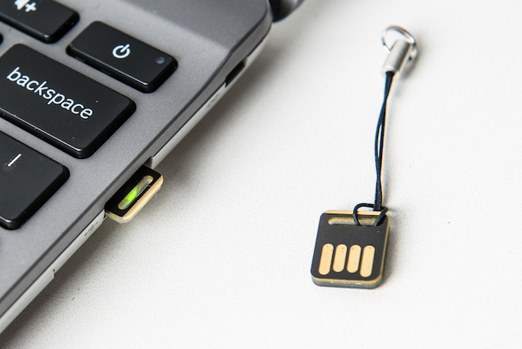

  
每年都十月都是John Flynn这哥们最喜欢的日子（别误会，这哥不是在天朝搞房地产的  编者注），不过他觉得今年的十月尤为如此。因为他花了整个月在尝试怎样黑进Facebook的计算机系统，这系统装备了一款新的安全工具，这安全工具号称安全性远超一般的密码。（其实真不是很稀奇，这个东西Google整过 可以参考另外一篇报道[http://www.wired.com/wiredenterprise/2013/01/google-password/](http://www.wired.com/wiredenterprise/2013/01/google-password/)    编者注）

Flynn这哥几年前从Google跳槽到Facebook, 在Facebook的安全团队干活，他们扮演的角色就是前方百计的尝试破坏这家社交网络公司赖以生存的计算机网络。他们被称为"<a href="https://www.facebook.com/notes/facebook-engineering/happy-hacktober/10151170449088920">Hacktober</a>",他们的职责就是竭尽所能找出公司计算机网络中有可能被其他人利用的漏洞。去年他们的安全团队就曾经尝试在他们的计算机网络中通过散布虚假的消息来传播计算机病毒。<!--more-->

看Flynn哥这么牛x,不过看来这次想要黑进他们公司的计算机网络确实是一项艰巨的任务。Facebook在今年就逐步给他们的员工系统装备Yubikeys, Yubikeys是一块非常小的硬件设备，可以让员工用他们的手指更加安全的登陆进他们系统。这个小工具确实非常强大，能够防止黑客轻易的黑进公司网络为所欲为，即便黑客已经控制了网络中一些被授权的机器（真心看不懂  不知道这东西到底是咋这么牛x 的  编者注）。

生产Yubikey的公司号称他们的设备已经被Silicon Valley中的7大公司采用，Facebook只是采用他们设备排名老二的网络公司。Google在今年早些时候就已经声称他们使用这个玩意了，他们声称他们已经厌烦了密码，最终他们提供了一个“ <a href="http://www.wired.com/wiredenterprise/2012/01/simple-pw/">limited amount of security</a>”。当时，Google宣称他们正在研究是否能够用Yubikey替代密码，至少是提高他们的安全性。 Yubikey只是一个小薄片的硬件，可以方便的插到USB口上，原理上你可以通过它设置你的电脑只能通过它才能够登陆和连接网络。

[http://www.wired.com/wiredenterprise/2013/10/facebook-yubikey/](http://www.wired.com/wiredenterprise/2013/10/facebook-yubikey/)